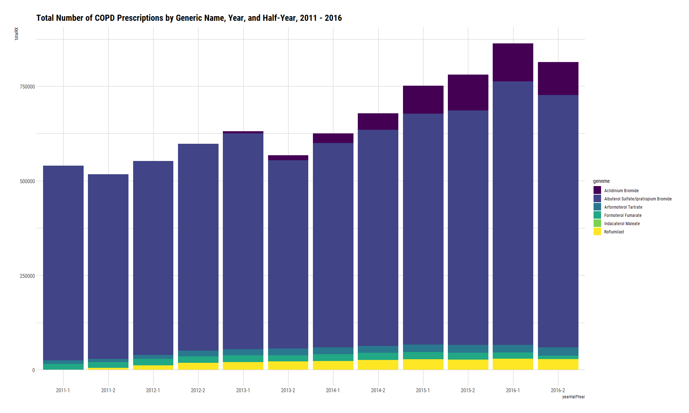

COPD Medicaid Expansion 2011 - 2016
================
Michael Maguire, MS
5/19/2021

``` r
library(data.table)
library(dplyr)
library(ggplot2)
library(hrbrthemes)
```

## Begin Cleaning

### Load base dataset.

``` r
base <-
  fread(
    file_location,
    colClasses = c("proper_ndc" = "character")
  )
```

### Read in supplementary datasets.

``` r
in1 <-
  readxl::read_xlsx(
    path = "./data/raw/aggregate-by-state-incl-new-states.xlsx"
  )

in2 <-
  readxl::read_xlsx(
    path = "./data/raw/On-label prescriptions of inhaled bronchodillators indicated for COPD_5.13.21.xlsx"
  )
```

### Create vectors for extraction

``` r
# State vector
st <-
  toupper(unique(in1$state))

st
```

    ##  [1] "AK" "AL" "AR" "AZ" "CA" "CO" "CT" "DC" "DE" "FL" "GA" "HI" "IA" "ID" "IL"
    ## [16] "IN" "KS" "KY" "LA" "MA" "MD" "ME" "MI" "MN" "MO" "MS" "MT" "NC" "NE" "NH"
    ## [31] "NJ" "NM" "NV" "NY" "OH" "OK" "OR" "PA" "RI" "SC" "SD" "TN" "TX" "UT" "VA"
    ## [46] "VT" "WA" "WI" "WV" "WY"

``` r
# Year vector
yrs <- 
  unique(in1$year)

yrs
```

    ## [1] 2011 2012 2013 2014 2015 2016

``` r
# NDC vector
rx <- 
  gsub(unique(in2$NDC), pattern = "'", replacement = "")

rx
```

    ##  [1] "00310080039" "00310080060" "00456080031" "00456080060" "72124000201"
    ##  [6] "72124000202" "00083016702" "00083016711" "00083016774" "00085140101"
    ## [11] "00085140201" "38779229506" "49502060530" "49502060561" "49502060595"
    ## [16] "63402091101" "63402091104" "63402091130" "63402091164" "00078061915"
    ## [21] "00078061961" "63402067530" "00310008828" "00310008839" "00310009530"
    ## [26] "00310009539" "00310009590" "00456009520" "00456009530" "00456009563"
    ## [31] "00456009590" "00093672373" "00093672374" "00185732213" "00185732230"
    ## [36] "00185732260" "00378698858" "00378698891" "00378698893" "00378967130"
    ## [41] "00378967131" "00378967158" "00378967160" "00378967191" "00378967193"
    ## [46] "00487020101" "00487020102" "00487020103" "00487020106" "00487020160"
    ## [51] "00591343330" "00591343360" "00591381730" "00591381739" "00591381760"
    ## [56] "00591381766" "00597001314" "00597002402" "00781714629" "00781714663"
    ## [61] "00781714664" "00781714687" "16252054733" "16252054766" "49502067230"
    ## [66] "49502067231" "49502067260" "60687040579" "60687040583" "69097017348"
    ## [71] "69097017353" "69097017364" "69097084034" "69097084053" "76204060001"
    ## [76] "76204060005" "76204060012" "76204060030" "76204060060"

### Trim dataset to years and states of interest

``` r
# Extract years and states, keeping select variables.
yrSt <-
  base[
    i = (year %in% yrs) & (state %in% st),
    j = .(year, proper_ndc, quarter, state, suppression, numberrx, prodnme, gennme)
  ]

yrSt
```

    ##           year  proper_ndc quarter state suppression numberrx
    ##        1: 2014 00002010102       1    TN           T        0
    ##        2: 2013 00002010102       4    TN           T        0
    ##        3: 2016 00002035102       1    MI           T        0
    ##        4: 2016 00002035102       4    MA           T        0
    ##        5: 2016 00002035102       2    MA           T        0
    ##       ---                                                    
    ## 22582392: 2014 99207085060       4    MS           T        0
    ## 22582393: 2014 99207085060       4    WV           T        0
    ## 22582394: 2014 99207085060       4    FL           T        0
    ## 22582395: 2014 99207085060       3    PA           T        0
    ## 22582396: 2014 99207085060       3    AK           T        0
    ##                             prodnme                               gennme
    ##        1: AMMONIUM CHLORIDE TABLETS                    Ammonium Chloride
    ##        2: AMMONIUM CHLORIDE TABLETS                    Ammonium Chloride
    ##        3:             DARVOCET-N 50 Acetaminophen/Propoxyphene Napsylate
    ##        4:             DARVOCET-N 50 Acetaminophen/Propoxyphene Napsylate
    ##        5:             DARVOCET-N 50 Acetaminophen/Propoxyphene Napsylate
    ##       ---                                                               
    ## 22582392:                      LUZU                         Luliconazole
    ## 22582393:                      LUZU                         Luliconazole
    ## 22582394:                      LUZU                         Luliconazole
    ## 22582395:                      LUZU                         Luliconazole
    ## 22582396:                      LUZU                         Luliconazole

### Extract drugs of interest

``` r
drugs <-
  yrSt[
    i = proper_ndc %in% rx
  ]

drugs
```

    ##        year  proper_ndc quarter state suppression numberrx
    ##     1: 2016 00078061915       3    MI           F       31
    ##     2: 2016 00078061915       3    WA           F       92
    ##     3: 2016 00078061915       1    MI           F       46
    ##     4: 2016 00078061915       2    WA           F       80
    ##     5: 2016 00078061915       2    MI           F       43
    ##    ---                                                    
    ## 45982: 2015 76204060060       4    MI           F       30
    ## 45983: 2015 76204060060       4    CA           F       21
    ## 45984: 2015 76204060060       4    CA           F       31
    ## 45985: 2015 76204060060       4    KY           F      171
    ## 45986: 2015 76204060060       4    IN           F       71
    ##                                      prodnme
    ##     1:                      ARCAPTA NEOHALER
    ##     2:                      ARCAPTA NEOHALER
    ##     3:                      ARCAPTA NEOHALER
    ##     4:                      ARCAPTA NEOHALER
    ##     5:                      ARCAPTA NEOHALER
    ##    ---                                      
    ## 45982: IPRATROPIUM BROMIDE-ALBUTEROL SULFATE
    ## 45983: IPRATROPIUM BROMIDE-ALBUTEROL SULFATE
    ## 45984: IPRATROPIUM BROMIDE-ALBUTEROL SULFATE
    ## 45985: IPRATROPIUM BROMIDE-ALBUTEROL SULFATE
    ## 45986: IPRATROPIUM BROMIDE-ALBUTEROL SULFATE
    ##                                       gennme
    ##     1:                   Indacaterol Maleate
    ##     2:                   Indacaterol Maleate
    ##     3:                   Indacaterol Maleate
    ##     4:                   Indacaterol Maleate
    ##     5:                   Indacaterol Maleate
    ##    ---                                      
    ## 45982: Albuterol Sulfate/Ipratropium Bromide
    ## 45983: Albuterol Sulfate/Ipratropium Bromide
    ## 45984: Albuterol Sulfate/Ipratropium Bromide
    ## 45985: Albuterol Sulfate/Ipratropium Bromide
    ## 45986: Albuterol Sulfate/Ipratropium Bromide

### Collapse quarters into half-years.

``` r
drugsM1 <-
  drugs[
    i = ,
    j = 
      halfyear := fcase(
        quarter %in% c(1:2), 1,
        quarter %in% c(3:4), 2,
        default = NA
      )
  ]

# Check to make sure quarters were cased correctly.
drugsM1 %>%
  janitor::tabyl(halfyear, quarter)
```

    ##  halfyear     1     2     3     4
    ##         1 11219 11349     0     0
    ##         2     0     0 11529 11889

### Aggregate to year, state, halfyear, and suppression level

``` r
drugsAggState <-
  drugsM1[
    i  = ,
    j  = .(
      totalRX = sum(numberrx)
    ),
    by = c("year", "state", "halfyear", "suppression") 
  ]

setorder(drugsAggState, year, state, halfyear)

drugsAggState
```

    ##       year state halfyear suppression totalRX
    ##    1: 2011    AK        1           T       0
    ##    2: 2011    AK        1           F    1445
    ##    3: 2011    AK        2           T       0
    ##    4: 2011    AK        2           F    1355
    ##    5: 2011    AL        1           F   11634
    ##   ---                                        
    ## 1196: 2016    WV        2           F   10635
    ## 1197: 2016    WY        1           T       0
    ## 1198: 2016    WY        1           F     480
    ## 1199: 2016    WY        2           T       0
    ## 1200: 2016    WY        2           F    1425

### Aggregate to year, state, halfyear, suppression, and generic name level

``` r
drugsAggGeneric <-
  drugsM1[
    i  = ,
    j  = .(
      totalRX = sum(numberrx)
    ),
    by = c("year", "gennme", "state", "halfyear", "suppression")
  ]

setorder(drugsAggGeneric, year, state, halfyear, gennme)

drugsAggGeneric
```

    ##       year                                gennme state halfyear suppression
    ##    1: 2011 Albuterol Sulfate/Ipratropium Bromide    AK        1           F
    ##    2: 2011 Albuterol Sulfate/Ipratropium Bromide    AK        1           T
    ##    3: 2011                 Arformoterol Tartrate    AK        1           T
    ##    4: 2011                   Formoterol Fumarate    AK        1           T
    ##    5: 2011 Albuterol Sulfate/Ipratropium Bromide    AK        2           T
    ##   ---                                                                      
    ## 4996: 2016                 Arformoterol Tartrate    WY        2           F
    ## 4997: 2016                   Formoterol Fumarate    WY        2           T
    ## 4998: 2016                   Formoterol Fumarate    WY        2           F
    ## 4999: 2016                           Roflumilast    WY        2           F
    ## 5000: 2016                           Roflumilast    WY        2           T
    ##       totalRX
    ##    1:    1445
    ##    2:       0
    ##    3:       0
    ##    4:       0
    ##    5:       0
    ##   ---        
    ## 4996:     259
    ## 4997:       0
    ## 4998:      65
    ## 4999:      13
    ## 5000:       0

### Aggregate by year, state, halfyear, generic, brand, and suppression level

``` r
drugsAggProdnme <-
  drugsM1[
    i  = ,
    j  = .(
      totalRX = sum(numberrx)
    ),
    by = c("year", "gennme", "prodnme", "state", "halfyear", "suppression")
  ]

setorder(drugsAggProdnme, year, state, halfyear, prodnme)  

drugsAggProdnme
```

    ##       year                                gennme
    ##    1: 2011                 Arformoterol Tartrate
    ##    2: 2011 Albuterol Sulfate/Ipratropium Bromide
    ##    3: 2011 Albuterol Sulfate/Ipratropium Bromide
    ##    4: 2011                   Formoterol Fumarate
    ##    5: 2011 Albuterol Sulfate/Ipratropium Bromide
    ##   ---                                           
    ## 7330: 2016                   Formoterol Fumarate
    ## 7331: 2016 Albuterol Sulfate/Ipratropium Bromide
    ## 7332: 2016 Albuterol Sulfate/Ipratropium Bromide
    ## 7333: 2016                   Formoterol Fumarate
    ## 7334: 2016                    Aclidinium Bromide
    ##                                     prodnme state halfyear suppression totalRX
    ##    1:                               BROVANA    AK        1           T       0
    ##    2:                             COMBIVENT    AK        1           F    1056
    ##    3:                                DUONEB    AK        1           T       0
    ##    4:                     FORADIL AEROLIZER    AK        1           T       0
    ##    5: IPRATROPIUM BROMIDE-ALBUTEROL SULFATE    AK        1           F     389
    ##   ---                                                                         
    ## 7330:                     FORADIL AEROLIZER    WY        2           T       0
    ## 7331: IPRATROPIUM BROMIDE-ALBUTEROL SULFATE    WY        2           T       0
    ## 7332: IPRATROPIUM BROMIDE-ALBUTEROL SULFATE    WY        2           F     921
    ## 7333:                           PERFOROMIST    WY        2           F      65
    ## 7334:                      TUDORZA PRESSAIR    WY        2           T       0

### Create final dataset.

``` r
final <-
  in1 %>%
    select(state, group, year, half_year, chipMedicaidEnroll) %>%
    mutate(state = toupper(state)) %>%
    rename(halfyear = half_year) %>%
    left_join(
      drugsAggState,
      by = c(
        "state" = "state",
        "year" = "year",
        "halfyear" = "halfyear"
      )
    )

final
```

    ## # A tibble: 1,200 x 7
    ##    state group  year halfyear chipMedicaidEnroll suppression totalRX
    ##    <chr> <dbl> <dbl>    <dbl>              <dbl> <chr>         <dbl>
    ##  1 AK        0  2011        1             118117 T                 0
    ##  2 AK        0  2011        1             118117 F              1445
    ##  3 AK        0  2011        2             119175 T                 0
    ##  4 AK        0  2011        2             119175 F              1355
    ##  5 AK        0  2012        1             120240 T                 0
    ##  6 AK        0  2012        1             120240 F              1638
    ##  7 AK        0  2012        2             119723 T                 0
    ##  8 AK        0  2012        2             119723 F              1671
    ##  9 AK        0  2013        1             120388 T                 0
    ## 10 AK        0  2013        1             120388 F              1821
    ## # ... with 1,190 more rows

``` r
finalRx <-
  in1 %>%
    select(state, group, year, half_year, chipMedicaidEnroll) %>%
    mutate(
      state = toupper(state),
      group = factor(group, levels = c(0, 1), labels = c("Control", "Treatment"))
      ) %>%
    rename(halfyear = half_year) %>%
    left_join(
      drugsAggProdnme,
      by = c(
        "state" = "state",
        "year" = "year",
        "halfyear" = "halfyear"
      )
    )

finalRx
```

    ## # A tibble: 7,334 x 9
    ##    state group   year halfyear chipMedicaidEnr~ gennme    prodnme    suppression
    ##    <chr> <fct>  <dbl>    <dbl>            <dbl> <chr>     <chr>      <chr>      
    ##  1 AK    Contr~  2011        1           118117 Arformot~ BROVANA    T          
    ##  2 AK    Contr~  2011        1           118117 Albutero~ COMBIVENT  F          
    ##  3 AK    Contr~  2011        1           118117 Albutero~ DUONEB     T          
    ##  4 AK    Contr~  2011        1           118117 Formoter~ FORADIL A~ T          
    ##  5 AK    Contr~  2011        1           118117 Albutero~ IPRATROPI~ F          
    ##  6 AK    Contr~  2011        1           118117 Albutero~ IPRATROPI~ T          
    ##  7 AK    Contr~  2011        1           118117 Formoter~ PERFOROMI~ T          
    ##  8 AK    Contr~  2011        2           119175 Arformot~ BROVANA    T          
    ##  9 AK    Contr~  2011        2           119175 Albutero~ COMBIVENT  F          
    ## 10 AK    Contr~  2011        2           119175 Roflumil~ DALIRESP   T          
    ## # ... with 7,324 more rows, and 1 more variable: totalRX <dbl>

## Begin Plotting

### Plot 1: Number of Prescriptions by Year and Half-Year

``` r
final %>%
  filter(suppression == "F") %>%
  mutate(yearHalfYear = paste0(year, "-", halfyear)) %>%
    ggplot() +
      geom_col(
        mapping = aes(
          x = yearHalfYear,
          y = totalRX
        ),
        fill = "forestgreen"
      ) +
      theme_ipsum_rc() +
      ggtitle(
        "Total Number of COPD Prescriptions by Year, and Half-Year, 2011 - 2016"
      )
```

<!-- -->

### Plot 2: Number of Generic Name Prescriptions by Year and Half-Year

``` r
  finalRx %>%
    filter(suppression == "F") %>%
    mutate(yearHalfYear = paste0(year, "-", halfyear)) %>%
    ggplot() +
      geom_col(
        mapping = aes(
          x = yearHalfYear,
          y = totalRX,
          fill = gennme
        )
      ) +
      theme_ipsum_rc() +
      ggtitle(
        "Total Number of COPD Prescriptions by Generic Name, Year, and Half-Year, 2011 - 2016"
      ) +
      scale_fill_viridis_d()
```

<!-- -->

### Plot 3: Number of Generic Name Prescriptions by Year, Half-Year, and Treatment Group

``` r
finalRx %>%
  filter(suppression == "F") %>%
  mutate(yearHalfYear = paste0(year, "-", halfyear)) %>%
    ggplot() +
      geom_col(
        mapping = aes(
          x = yearHalfYear,
          y = totalRX,
          fill = gennme
        )
      ) +
      facet_wrap(~ group) +
      theme_ipsum_rc() +
      scale_y_continuous(labels = scales::comma) +
      ggtitle(
        "Total Number of COPD Prescriptions by Generic Name, Year, Half-Year and Treatment Group, 2011 - 2016"
      ) +
      scale_fill_viridis_d()
```

<!-- -->

### Plot 4: Number of Enrollees by Year and Half-Year

``` r
final %>%
  filter(suppression == "F") %>%
  mutate(yearHalfYear = paste0(year, "-", halfyear)) %>%
    ggplot() +
      geom_col(
        mapping = aes(
          x = yearHalfYear,
          y = chipMedicaidEnroll
        ),
        fill = "forestgreen"
      ) +
      theme_ipsum_rc() +
      ggtitle(
        "Total Number of Enrollees by Year and Half-Year, 2011 - 2016"
      ) + 
      scale_y_continuous(
        labels = scales::comma
      )
```

<!-- -->

### Plot 5: Number of Enrollees by Year, Half-Year, and Treatment Group

``` r
final %>%
  filter(suppression == "F") %>%
  mutate(
    yearHalfYear = paste0(year, "-", halfyear),
    group = factor(group, levels = c(0, 1), labels = c("Control", "Treatment"))
    ) %>%
    ggplot() +
      geom_col(
        mapping = aes(
          x = yearHalfYear,
          y = chipMedicaidEnroll,
          fill = group
        )
      ) +
      facet_wrap(~ group) +
      scale_fill_viridis_d() +
      theme_ipsum_rc() +
      ggtitle(
        "Total Number of Enrollees by Year, Half-Year, and Treatment Group, 2011 - 2016"
      ) + 
      scale_y_continuous(
        labels = scales::comma
      )
```

<!-- -->

### Plot 6: Number of Prescriptions by Year, Half-Year, and State

``` r
final %>%
  filter(suppression == "F") %>%
  mutate(yearHalfYear = paste0(year, "-", halfyear)) %>%
    ggplot() +
      geom_col(
        mapping = aes(
          x    = yearHalfYear,
          y    = totalRX,
          fill = state
        ),
        color = "black"
      ) +
      facet_wrap(~ state) +
      scale_fill_viridis_d() +
      theme_ipsum_rc() +
      theme(
        legend.position = "none",
        axis.text.x = element_text(angle = 90, vjust = 0.5),
      ) +
      ggtitle(
        "Total Number of COPD Prescriptions by Year, Half-Year, and State, 2011 - 2016"
      )
```

<!-- -->

### Plot 7: Number of Enrollees by Year, Half-Year, and State

``` r
final %>%
  filter(suppression == "F") %>%
  mutate(yearHalfYear = paste0(year, "-", halfyear)) %>%
    ggplot() +
      geom_col(
        mapping = aes(
          x = yearHalfYear,
          y = chipMedicaidEnroll,
          fill = state
        ),
        color = "black",
        alpha = 0.85
      ) +
      facet_wrap(~ state) +
      scale_fill_viridis_d() +
      theme_ipsum_rc() +
      theme(
        legend.position = "none",
        axis.text.x = element_text(angle = 90, vjust = 0.5),
      ) +
      scale_y_continuous(
        labels = scales::comma
      ) +
      ggtitle(
        "Total Number of Enrollees by Year, Half-Year, and State, 2011 - 2016"
      )
```

<!-- -->

### Plot 8: Number of Prescriptions by Year, Half-Year, State, and filled by Treatment Group

``` r
final %>%
  filter(suppression == "F") %>%
  mutate(yearHalfYear = paste0(year, "-", halfyear)) %>%
    ggplot() +
      geom_col(
        mapping = aes(
          x = yearHalfYear,
          y = totalRX,
          fill = factor(x = group, levels = c(0, 1), labels = c("Control", "Treatment"))
        ),
        color = "black",
        alpha = 0.85
      ) +
        facet_wrap(~ state) +
        scale_fill_viridis_d() +
        theme_ipsum_rc() +
        labs(fill = "Group") +
        theme(
          axis.text.x = element_text(angle = 90, vjust = 0.5)
        ) +
        ggtitle(
          "Total Number of COPD Prescriptions by Year, Half-Year, State, and Treatment Group, 2011 - 2016"
        )
```

<!-- -->

### Plot 9: Prescription Rate per 100 Enrollees by Year and Half-Year

``` r
final %>%
  filter(suppression == "F") %>%
  mutate(yearHalfYear = paste0(year, "-", halfyear)) %>%
    ggplot() +
      geom_col(
        mapping = aes(
          x = yearHalfYear,
          y = (totalRX / chipMedicaidEnroll) * 100
        ),
        fill = "forestgreen"
      ) +
        theme_ipsum_rc() +
        ggtitle(
          "COPD Prescription Rate per 100 Medicaid Enrollees, 2011 - 2016"
        )
```

<!-- -->

### Plot 10: Prescription Rate per 100 Enrollees by Year, Half-Year, and State

``` r
final %>%
  filter(suppression == "F") %>%
  mutate(yearHalfYear = paste0(year, "-", halfyear)) %>%
    ggplot() +
      geom_col(
        mapping = aes(
          x = yearHalfYear,
          y = (totalRX / chipMedicaidEnroll) * 100,
          fill = state
        ),
        color = "black",
        alpha = 0.85
      ) +
        facet_wrap(~ state) +
        scale_fill_viridis_d() +
        theme_ipsum_rc() +
        theme(
          legend.position = "none",
          axis.text.x = element_text(angle = 90, vjust = 0.5)
        ) +
        ggtitle(
          "Prescription Rate per 100 Medicaid Enrollees by Year, Half-Year, and State, 2011 - 2016"
        )
```

<!-- -->

### Plot 11: Prescription Rate per 100 Enrollees by Year, Half-Year, State, and Treatment Group

``` r
final %>%
  filter(suppression == "F") %>%
  mutate(yearHalfYear = paste0(year, "-", halfyear)) %>%
    ggplot() +
      geom_col(
        mapping = aes(
          x = yearHalfYear,
          y = (totalRX / chipMedicaidEnroll) * 100,
          fill = factor(x = group, levels = c(0, 1), labels = c("Control", "Treatment")),
        ),
        color = "black",
        alpha = 0.85
      ) +
      facet_wrap(~ state) +
      scale_fill_viridis_d() +
      theme_ipsum_rc() +
      theme(
        axis.text.x = element_text(angle = 90, vjust = 0.5)
      ) +
      labs(
        fill = "Group"
      ) +
      ggtitle(
        "Prescription Rate per 100 Medicaid Enrollees by Year, Half-Year, and State, 2011 - 2016"
      )
```

<!-- -->
